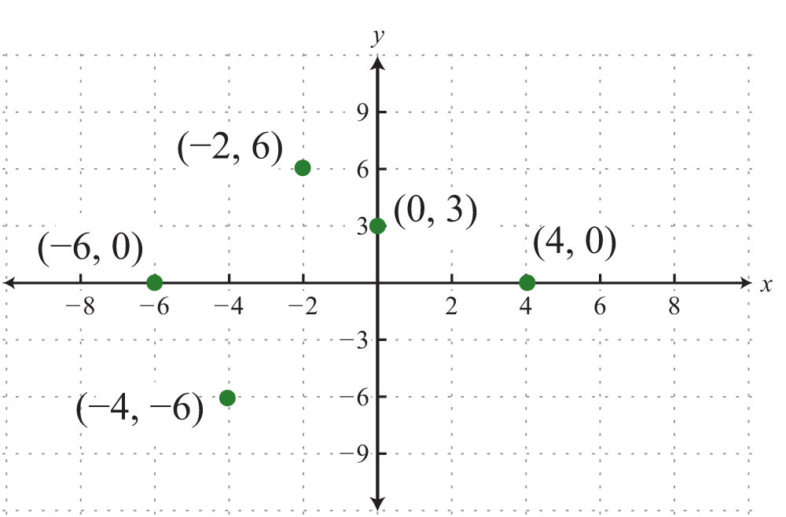

# Evil Python Lesson 5: Games!

[All Lessons](https://zsiegel92.github.io/evilpython/)

[TOC]


## Python Review

### Python `input`

The function `input` returns a variable of type `str`. If `x = input()` is executed and `5` <kbd>Enter</kbd> is typed, then `type(x)` will yield `<class 'str'>`.

<iframe height="400px" width="100%" src="https://repl.it/@ZSiegel/Input2?lite=true" scrolling="no" frameborder="no" allowtransparency="true" allowfullscreen="true" sandbox="allow-forms allow-pointer-lock allow-popups allow-same-origin allow-scripts allow-modals"></iframe>

Notice that the variable `age` stores a number but its type is `str`.

### Infinite Input Loops: `while True`

Many programs (like **games**) keep running and accepting input until the user exits. We can create an **infinite loop** using `while` without terminating.

Recall that `while` loops need a terminating condition:
```python
x = 0 # initializing x
while x < 5:
	print("Executing the loop")
	x += 1 # incrementing x
```

Since `x += 1` increases `x` by `1` on each loop iteration, eventually the condition `x < 5` will evaluate to `False` and the loop will stop executing!

We can create an infinite loop easily, but it doesn't do us much good:

```python
>>> while True:
...     print("Executing the loop")
...
Executing the loop
Executing the loop
Executing the loop
Executing the loop
Executing the loop
Executing the loop
Executing the loop
.
.
.
```

**With `input()`, we can create infinite loops that are actually useful!**

<iframe height="400px" width="100%" src="https://repl.it/@ZSiegel/Inputinfiniteloop?lite=true" scrolling="no" frameborder="no" allowtransparency="true" allowfullscreen="true" sandbox="allow-forms allow-pointer-lock allow-popups allow-same-origin allow-scripts allow-modals"></iframe>


## Assignments

1. **Create a game** that asks for a direction on an infinite loop and keeps track of your coordinates. Your coordinates should start at `x = 0` and `y = 0`, and you should use the following directions:
	* If input is `a`, **move left** by decreasing your `x` coordinate using `x -= 1`
	* If input is `s`, **move down** by decreasing your `y` coordinate using `y -= 1`
	* If input is `d`, **move right** by increasing your `x` coordinate using `x += 1`
	* If input is `w`, **move up** by increasing your `y` coordinate using `y += 1`

	<iframe height="400px" width="100%" src="https://repl.it/@ZSiegel/InputNavigationGame?lite=true" scrolling="no" frameborder="no" allowtransparency="true" allowfullscreen="true" sandbox="allow-forms allow-pointer-lock allow-popups allow-same-origin allow-scripts allow-modals"></iframe>

	***NOTE:*** An **ordered pair** is two numbers in parentheses that give coordinates. For example, `(1,2)` means "The point where \\(x\\) is \\(1\\) and \\(y\\) is \\(2\\)".

	<div style="text-align: center;">
		
		<br>
		Ordered Pairs
	</div>

2. Try to create the following games:
	* [Treasure Walker](https://raw.githubusercontent.com/zsiegel92/evilpython/master/Games/runner.py)
	* [Treasure Walker](https://raw.githubusercontent.com/zsiegel92/evilpython/master/Games/treasure.py)
	* [Treasure Snake](https://raw.githubusercontent.com/zsiegel92/evilpython/master/Games/treasure_snake.py)

	<script type="text/javascript" async
	  src="https://cdnjs.cloudflare.com/ajax/libs/mathjax/2.7.5/MathJax.js?config=TeX-MML-AM_CHTML">
	</script>
