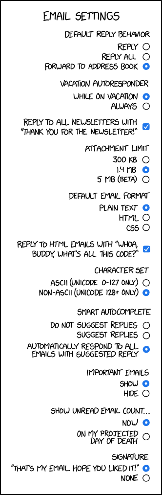

# Evil Python Lesson 10: Mail Merge

[All Lessons](https://zsiegel92.github.io/evilpython/)

[TOC]

## Review: Sending Emails

Please review [Lesson 3: Email](https://zsiegel92.github.io/evilpython/lesson_3.html) from this tutorial.




## An Email Package

Before running the following code, type the following commands in the shell:

```sh
set EMAIL="your_email@email_provider.domain"
set PASSWORD="your_password"
```
>This is only for Windows. For Mac or Linux, replace `set` with `export`.


> **DO NOT** save email passwords directly in your code files. Using environmet variables such as this is the best way.

### Sending Basic Text
```python
import os
import smtplib

username = os.environ.get('EMAIL')
password = os.environ.get('PASSWORD')
to_address = input("To whom should a message be sent?")

message = "the message"
subject = "the subject"

fullMessage = "\r\n".join([
    "From: " + username,
    "To: " + to_address,
    "Subject: " + subject,
    "",
    message
])
server = smtplib.SMTP_SSL('smtp.gmail.com', 465)
server.ehlo()
server.login(username, password)
server.sendmail(username, to_address, fullMessage)
server.close()
```
> Make sure this code works with the email account you created


### Sending (More Complicated/Customizable) HTML

```python
import os
import smtplib
from email.mime.multipart import MIMEMultipart
from email.mime.text import MIMEText

username = os.environ.get('EMAIL')
password = os.environ.get('PASSWORD')
to_address = input("To whom should a message be sent?")

message = "the message"
subject = "the subject"

html = f"<html><head></head><body style='color:red'>{message}</body></html>"

msg = MIMEMultipart('alternative')
msg['Subject']=subject
msg['From']=username
msg['To']=to_address
msg.attach(MIMEText(html,'html'))

server = smtplib.SMTP_SSL('smtp.gmail.com', 465)
server.ehlo()
server.login(username, password)
server.sendmail(username, to_address, msg.as_string())
server.close()
```
>Make sure this is working before doing anything else!

### Custom Emailer Package


**Create a file called `emailer.py`**. Add this code:

```python
import os
import smtplib
from email.mime.multipart import MIMEMultipart
from email.mime.text import MIMEText


def send_email(to_address, html_body, subject):
	username = os.environ.get('EMAIL')
	password = os.environ.get('PASSWORD')

	html = f"<html><head></head><body>{html_body}</body></html>"

	msg = MIMEMultipart('alternative')
	msg['Subject']=subject
	msg['From']=username
	msg['To']=to_address
	msg.attach(MIMEText(html,'html'))

	server = smtplib.SMTP_SSL('smtp.gmail.com', 465)
	server.ehlo()
	server.login(username, password)
	server.sendmail(username, to_address, msg.as_string())
	server.close()
```

Now, to use this package, create another file called `sending_emails.py` and use this code:

```python
from emailer import send_email

send_email(
           'your_own_email@host.domain',
           '<div style="color:red">TESTING</div>',
           "THIS IS A TEST! And this is the subject."
           )

```
> Make sure to change `'your_own_email@host.domain'` to your actual email address so that you can receive this message.


## Merging Mail

What is **mail merge**?

* [How to do mail merge in MS Excel (<span style="color:red">BORING</span>)](https://support.office.com/en-us/article/mail-merge-using-an-excel-spreadsheet-858c7d7f-5cc0-4ba1-9a7b-0a948fa3d7d3)


<iframe width="560" height="315" src="https://www.youtube-nocookie.com/embed/OgqTe8NqYu4" frameborder="0" allow="accelerometer; autoplay; encrypted-media; gyroscope; picture-in-picture" allowfullscreen></iframe>


### Merging Mail in Python


Review the concept of [Python **classes**](https://zsiegel92.github.io/Eitan_S/Lessons/Lesson_7_Classes/Python7.html). We will create an `EmailData` class, to create several customized messages.

```python
from emailer import send_email

class EmailData:
	from_name = ""
	about_name = ""
	to_name = ""
	to_address = ""
	occasion = ""
	location = ""
	favorite_thing = ""

	def __init__(self,from_name,about_name,to_name,to_address,occasion,location,favorite_thing):
		self.from_name = from_name
		self.about_name = about_name
		self.to_name = to_name
		self.to_address = to_address
		self.occasion = occasion
		self.location = location
		self.favorite_thing = favorite_thing


info1 = EmailData('Zach','Ethan','Michael','michael311@gmail.com','quinceañera','The Cheesecake Factory','their pretty little cupcakes')
info2 = EmailData('Elyse','Zach','Ruth','ruth22@gmail.com','first-grade graduation','Chuck-E-Cheese','terrible pizza and sticky booths')

info_list = [info1, info2]

message_template = """
Hi {to_name},

I would like to invite you to {about_name}'s' {occasion}! We will be celebrating at {location} because, as you know, {about_name} loves {favorite_thing}.

Best wishes, {from_name}
"""
subject_template = "Hi {to_name}! You're invited..."

for info in info_list:
	message = message_template.format(
	                          to_name = info.to_name,
	                          about_name = info.about_name,
	                          occasion = info.occasion,
	                          location = info.location,
	                          favorite_thing = info.favorite_thing,
	                          from_name = info.from_name
	                          )
	subject = subject_template.format(
	                                  to_name = info.to_name
	                                  )
	send_email(
	           info.to_address,
	           message,
	           subject
	           )
```
> Make sure to change the `to_address` data (such as `'michael311@gmail.com'`) to **your** email address, so that **you** receive your test emails.

## Formatting with Jinja2

Jinja 2 is a Python package tht allows formatting with much more precision than the Python built-in `format` function. **More on this next time**!

## Reading data from a spreadsheet

**More on this next time**!

## Assignments

1. Use your custom mail merge to invite each of your friends to a **custom event**!

> Hi **Michael**,
>
> I would like to invite you to **Ethan**'s **quinceañera**!
> We will be celebrating at **The Cheesecake Factory** because, as you know, **Ethan** loves **their pretty little cupcakes**.
>
> Best wishes,
> **Zach**

and

> Hi **Ruth**,
>
> I would like to invite you to **Zach**'s **first-grade graduation**!
> We will be celebrating at **Chuck-E-Cheese** because, as you know, **Zach** loves **terrible pizza and sticky booths**.
>
> Best wishes,
> **Elyse**

First you will need to store everyone's information in a data table rougly as follows:

|From|About|To|Occasion|Location|Favorite Thing|
|--|--|--|--|--|--|
|Zach|Ethan|Michael|quinceañera|The Cheesecake Factory|their pretty little cupcakes|
|Elyse|Zach|Ruth|first-grade graduation|Chuck-E-Cheese|terrible pizza and sticky booths|
