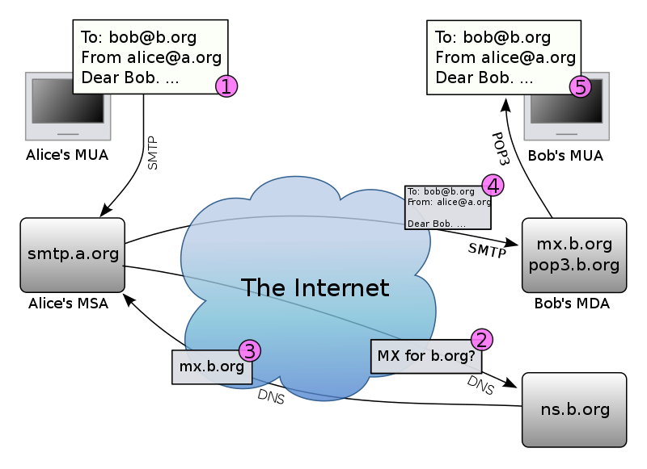

# Evil Python Lesson 3: Email!

[All Lessons](https://zsiegel92.github.io/evilpython/)

[TOC]

## What is email?





>"The diagram to the right shows a typical sequence of events that takes place when sender Alice transmits a message using a mail user agent (MUA) addressed to the email address of the recipient.[28]
>
>Email operation
>
><ol>
	<li> The MUA formats the message in email format and uses the submission protocol, a profile of the Simple Mail Transfer Protocol (SMTP), to send the message content to the local mail submission agent (MSA), in this case smtp.a.org. </li>
	<li>The MSA determines the destination address provided in the SMTP protocol (not from the message header), in this case bob@b.org which is a fully qualified domain address (FQDA). The part before the @ sign is the local part of the address, often the username of the recipient, and the part after the @ sign is a domain name. The MSA resolves a domain name to determine the fully qualified domain name of the mail server in the Domain Name System (DNS).</li>
	<li>The DNS server for the domain b.org (ns.b.org) responds with any MX records listing the mail exchange servers for that domain, in this case mx.b.org, a message transfer agent (MTA) server run by the recipient's ISP.[29]</li>
	<li>smtp.a.org sends the message to mx.b.org using SMTP. This server may need to forward the message to other MTAs before the message reaches the final message delivery agent (MDA).</li>
	<li>The MDA delivers it to the mailbox of user bob.</li>
	<li>Bob's MUA picks up the message using either the Post Office Protocol (POP3) or the Internet Message Access Protocol (IMAP)." - *[Wikipedia "Email"](https://en.wikipedia.org/wiki/Email#Operation)*</li>
	</ol>

### Making an Email Account for Development

When programatically sending emails, **SECURITY IS OF THE UTMOST IMPORTANCE!**.

1. Start by [creating a "dummy" email account with GMail](https://accounts.google.com/signup) using a real email account as the "backup" for the account.
2. **Create a secure password, and WRITE IT DOWN!**
3. In your inbox, click the user badge, and select "Google Account" (top right-hand corner of the page). Click on "Security" on the left.
4. Go down to "Less secure app access" and TURN IT ON! We are building a "less secure" app.


## Email Client

## Sending Email

```python
from emailer import Emailer
import os

username = input("Enter username")
password = input("Enter password")

to_address = input("To whom should a message be sent?")

os.environ['EMAIL'] = username
os.environ['EMAIL_PASSWORD'] = password

emailer = Emailer()
emailer.email(to_address,message="generic_emailer_message",subject="generic_emailer_subject")
```


## Assignments

1.
